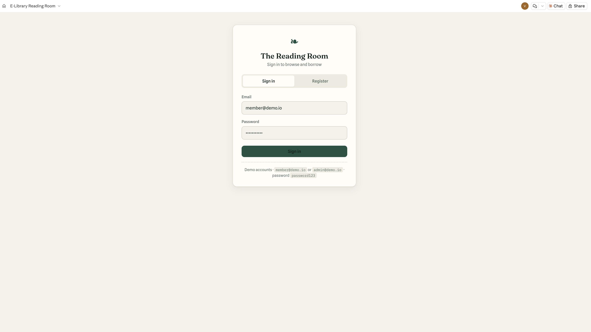
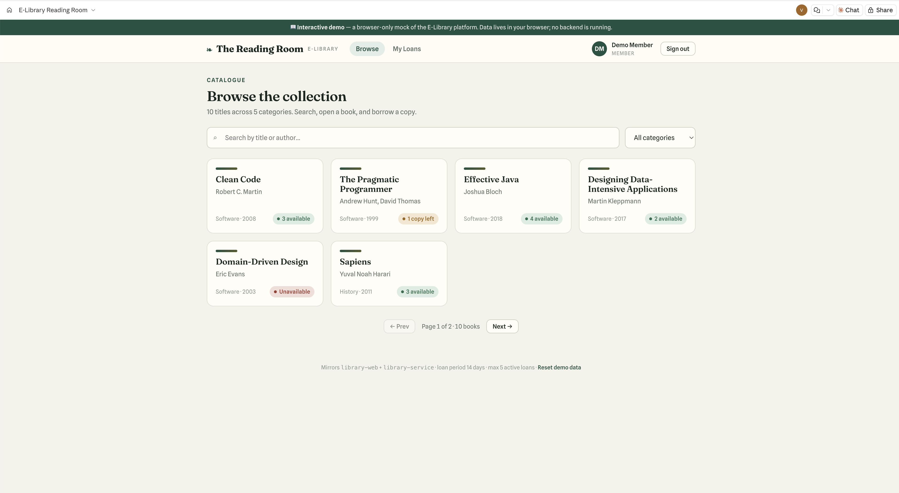
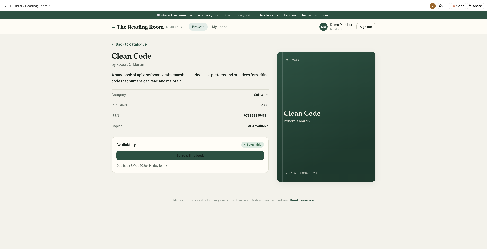

# E-Library Platform

A small e-library where authenticated members browse a catalogue of books, view
details, borrow and return copies, and see what they currently hold.

The system is split into two independent services:

| Folder | Stack | Role |
|---|---|---|
| [`library-service/`](./library-service) | Java 21 · Spring Boot 4 · Spring Data JPA · PostgreSQL | REST API + business rules |
| [`library-web/`](./library-web) | React 18 · TypeScript · Vite · Tailwind CSS · TanStack Query | Browser client |

The backend is **API-only** and the frontend runs on its own Vite dev server; they
communicate over HTTP with CORS configured between them. Each service has its own
README with setup and design notes — this file is the map and the quick start.





## Architecture at a glance

```
┌────────────────┐     JSON / JWT      ┌──────────────────┐     JPA      ┌────────────┐
│  library-web   │  ───────────────▶   │  library-service │  ─────────▶  │ PostgreSQL │
│  (Vite :5173)  │  ◀───────────────   │   (Spring :8080) │  ◀─────────  │            │
└────────────────┘                     └──────────────────┘              └────────────┘
```

- **Stateless JWT auth.** The client obtains a token from `/api/auth/login` or
  `/api/auth/register` and sends it as `Authorization: Bearer <token>` on every call.
- **Layered backend**: `web` (controllers/DTOs/mappers) → `service` (business rules)
  → `repository` (Spring Data JPA) → `domain` (entities). DTOs at the edge so entities
  never leak.
- **Server state on the client** is managed by TanStack Query, with cache
  invalidation on borrow/return so the catalogue and "My Loans" stay consistent.

## Prerequisites

- **Java 21** and **Maven** (a Maven wrapper `./mvnw` is included, so a system Maven
  is optional).
- **Node 20+** and npm.
- **PostgreSQL** running locally (the app uses `ddl-auto: update`, so it creates its
  own tables — you only need to create an empty database).

## Quick start

```bash
# 1. Database — create an empty DB (defaults: localhost:5432, user/pass "postgres")
createdb elibrary

# 2. Backend — starts on :8080 and seeds demo data on first run
cd library-service
./mvnw spring-boot:run

# 3. Frontend — in a second terminal, starts on :5173
cd library-web
npm install
npm run dev
```

Open http://localhost:5173 and sign in with a seeded account (below), or register a
new one.

### Seeded demo accounts

Created automatically on first backend start (only if the tables are empty):

| Email | Password | Role |
|---|---|---|
| `member@demo.io` | `password123` | MEMBER |
| `admin@demo.io` | `password123` | ADMIN |

Ten sample books are seeded alongside them. (The `member@demo.io` credentials are
pre-filled on the login screen for convenience.)

## API summary

Base path `/api`. All endpoints except the two `auth` routes require a Bearer token.

| Method | Path | Purpose |
|---|---|---|
| POST | `/auth/register` | Create an account, returns a JWT |
| POST | `/auth/login` | Authenticate, returns a JWT |
| GET | `/books` | Browse catalogue — `search`, `category`, `page`, `size` (paginated) |
| GET | `/books/{id}` | Book details |
| GET | `/loans/me` | The caller's loans — `?status=ACTIVE` for currently borrowed |
| POST | `/loans` | Borrow — body `{ "bookId": "<uuid>" }` |
| POST | `/loans/{id}/return` | Return a loan the caller owns |

See [`library-service/README.md`](./library-service/README.md) for request/response
shapes, error format, and the full list of enforced business rules.

## Running the tests

```bash
cd library-service && ./mvnw test     # backend: unit + repository + integration
cd library-web    && npm run test     # frontend: Vitest + React Testing Library
```

## Key assumptions & trade-offs

These are the notable "reasonable assumptions" made where the brief was open. Details
live in the per-service READMEs; the headline decisions:

- **Physical-copy loan model.** Books have `totalCopies` / `availableCopies`; borrowing
  decrements and returning increments. This gives real availability semantics and a
  natural place for concurrency control (`@Version` optimistic locking on `Book`).
- **Business rules in the service layer**, not the controllers or the database: a
  member may hold at most 5 active loans, cannot hold two active loans of the same
  book, and can only return their own loans. Violations map to HTTP 409.
- **`ddl-auto: update` instead of migrations.** Appropriate for a take-home; a
  production system would use Flyway/Liquibase. Called out here deliberately.
- **JWT over sessions** to keep the API stateless and the two services cleanly
  decoupled. Tokens are stored in `localStorage` on the client — a pragmatic choice
  for this scope; the trade-offs are noted in the frontend README.
- **No Docker** (per the brief) — services are run directly and Postgres is provided
  by the developer's environment.
```

